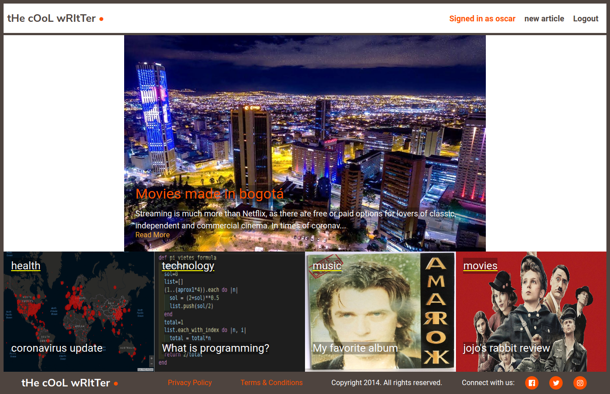

#  article project

Ruby on Rails Microverse Capstone Project By Oscar Russi

# live demo

[Live Demo](https://blueberry-custard-86240.herokuapp.com/login)

## Project Presentation (Video)

[Project Presentation](https://www.loom.com/share/f8e24c7dbe3b42a9b6872b88d4d1fed1)

# What it does

- This is an Articles website
- Registered users can add articles to this app and vote to any article
- In the root of the project, user can see the most popular article (according to votes)
- User can also see the most recent article for each category
- User can click on the category name to see all the articles of that category in the category page
- On the category page, user can click on article to see the full content of the article
- On the root page, users can click on the link "read more" to see the full content of the most popular article.
- If the user is not logged he/she can see the articles but not create one or vote
- User has a name, email and a password
- Articles has a title, text, image and at least one category
- Category has a name and a priority
- User can vote only one time for each article
- Users and articles have many votes
- A vote belongs to a user and an article
- An article can have many categories, and a category can have many articles
- ArticleCategory model for the "many to many" relationship between articles and categories
- Using active storage to save images of the articles
- saving the URL of the image in the attribute "picture" to avoid n+1 queries
- Using includes() to avoid n+1 queries

# How to run this project

- Install ruby
- Install ruby on rails
- Install bundle
- Run "bundle install" inside folder
- Run "rails db:migrate"
- Run "rails db:seed"
- Run "rails server" inside folder
- Go to http://127.0.0.1:3000/
* OPTIONAL:
- Run "rspec" for running the tests
- RUn "rubocop" for running the linter

#### and deployed to GitHub

## Authors

**Oscar Russi**
- Github: [@andresporras3423](https://github.com/andresporras3423/)
- Linkedin: [Oscar Russi](https://www.linkedin.com/in/oscar-andr%C3%A9s-russi-porras-053236167/)

## � Contributing

This is a project for educational purposes only. We are not accepting contributions.

## Attributions and Credit

Special thanks to Microverse, for this learning opportunity. 

## Show your support

Give a ⭐️ if you like this project!

## Enjoy!